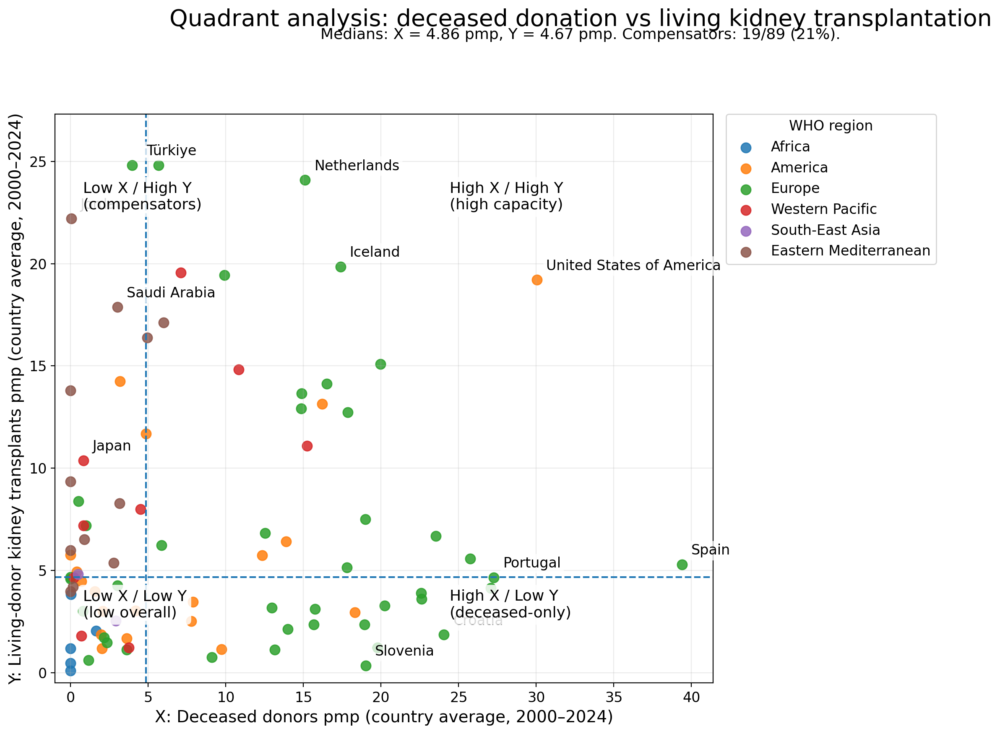

# Part B: content
**Project title:** Stats Project 2026 — Living vs Deceased Donation  
**Team members + student IDs:** [Name1, ID] • [Name2, ID] • [Name3, ID] • [Name4, ID]

## Research question
Do countries compensate for low deceased donation with higher living donation?

## Data
We use the Global Observatory on Donation and Transplantation (GODT), a WHO–ONT collaboration, and follow the official questionnaire definitions (WHO–ONT, n.d.-a; WHO–ONT, n.d.-b). Our two indicators are:  
- **X:** deceased donors per million population (**pmp**)  
- **Y:** living-donor kidney transplants (**pmp**)  

We focus on **2000–2024** and restrict to countries with **≥10 years of data** in both indicators (**n = 89**). Data were reshaped and analysed following tidy data principles (Wickham, 2014).

## Methods
We compute **country-level averages** over 2000–2024. Because both X and Y are **right-skewed**, we use **Spearman rank correlation** as the primary global test (with Pearson correlation as a robustness check).  
To characterise “system types”, we split countries into four quadrants using the sample medians (**median X = 4.86 pmp; median Y = 4.67 pmp**).  
Figures were produced in **R** using **ggplot2**.

## Findings
We find **no evidence of a global compensation pattern**. The relationship between X and Y is **weakly positive** and **not statistically significant**:  
- Spearman **ρ = 0.111**, **p = 0.302**  
- Pearson **r = 0.076**, **p = 0.477**  
- **n = 89**

A simple group comparison points the same way: countries **above the median** on deceased donation have **higher average living donation** (**mean Y = 8.52 vs 5.73**), which is the **opposite** of a compensation hypothesis.

The quadrant analysis reveals **heterogeneity** across countries. A “compensator” cluster (low deceased / high living) contains **19 of 89 countries (21%)**, including **Jordan (X = 0.04, Y = 22.2)**, **Türkiye (X = 4.0, Y = 24.8)**, **Saudi Arabia (X = 3.0, Y = 17.9)** and **Japan (X = 0.8, Y = 10.4)**.  
In contrast, a “deceased-only” model (high deceased / low living) is common in Western/Central Europe, with **Spain (X = 39.4, Y = 5.3)**, **Croatia (X = 24.0, Y = 1.9)** and **Slovenia (X = 19.0, Y = 0.4)** as clear examples. The **USA** is high on both dimensions (**X = 30.0, Y = 19.2**), standing out as a special case.

## Interpretation & limitations
Overall, the data do **not** support a universal substitution/compensation hypothesis. Instead, distinct regional system models appear: a Western European model centred on **deceased donation** and a smaller set of countries where **living donation** is relatively strong despite weak deceased donation. We do not test causal mechanisms. Finally, many countries have reporting gaps, so time trends should be interpreted with caution (see issues_log.md).

---

## Figures

### **Figure 1. Deceased vs living donation (n = 89)**
<!-- If your image is in the repo root as "fig1_scatter (1).png", keep this.
     If you renamed it to "fig1_scatter.png", change the filename below. -->

*Caption:* Deceased donation vs living-donor kidney transplantation (country averages 2000–2024). n = 89 (≥10 years coverage in both indicators). Spearman ρ = 0.111 (p = 0.302). Units: pmp. Source: GODT (WHO/ONT).

### **Figure 2. Quadrant classification (median split)**

*Caption:* Quadrant analysis using medians (X = 4.86 pmp, Y = 4.67 pmp). Compensators (low X / high Y) are 19/89 (21%). Units: pmp. Source: GODT (WHO/ONT).

---

## References

- Wickham, H. (2014). *Tidy Data*. *Journal of Statistical Software*, 59(10), 1–23. https://doi.org/10.18637/jss.v059.i10
- Global Observatory on Donation and Transplantation (GODT) — WHO/ONT. (n.d.). *How to quote / use GODT data*. Retrieved DD Month YYYY, from https://www.transplant-observatory.org/uses-of-data/
- Global Observatory on Donation and Transplantation (GODT) — WHO/ONT. (2020). *Transplant Observatory Questionnaire 2020* [PDF]. Retrieved DD Month YYYY, from https://www.transplant-observatory.org/download/questionnaire-2020/
- NIST/SEMATECH. (n.d.). *e-Handbook of Statistical Methods: Spearman’s rank correlation coefficient*. Retrieved DD Month YYYY, from https://www.itl.nist.gov/div898/software/dataplot/refman1/auxillar/spearc.htm
- Streit, S., Johnston-Webber, C., Mah, J., Prionas, A., Wharton, G., Casanova, D., Mossialos, E., & Papalois, V. (2023). Ten Lessons From the Spanish Model of Organ Donation and Transplantation. *Transplant International*, 36, 11009. https://doi.org/10.3389/ti.2023.11009
